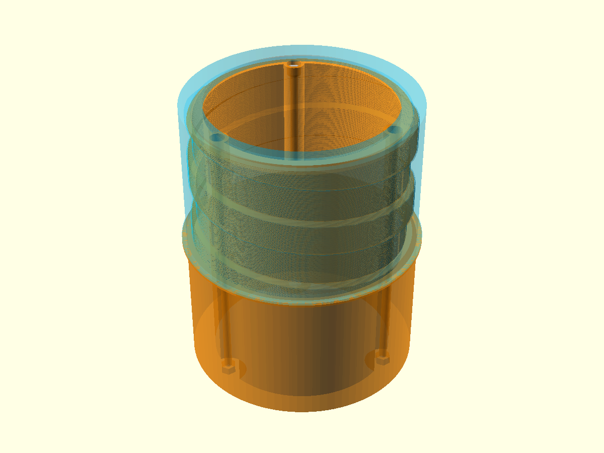
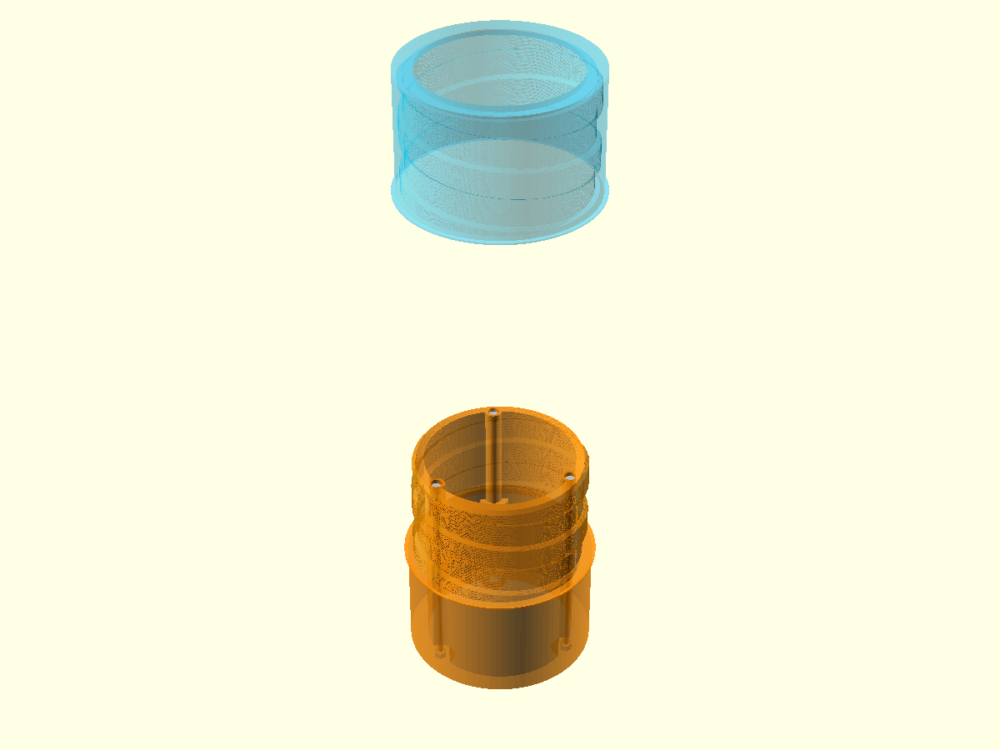
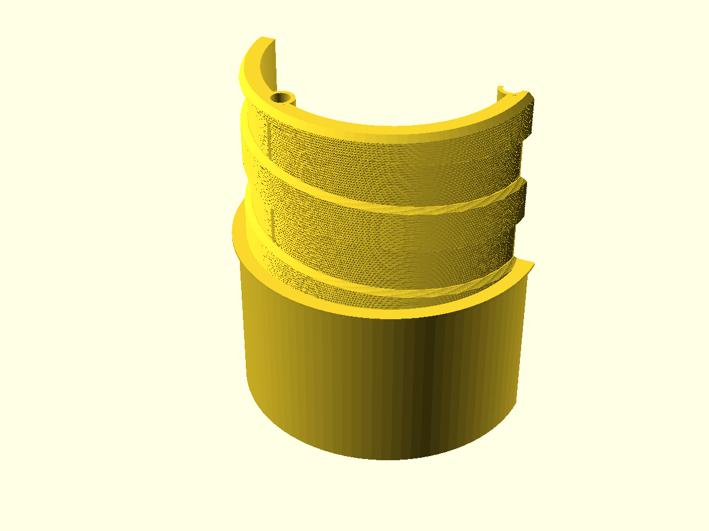
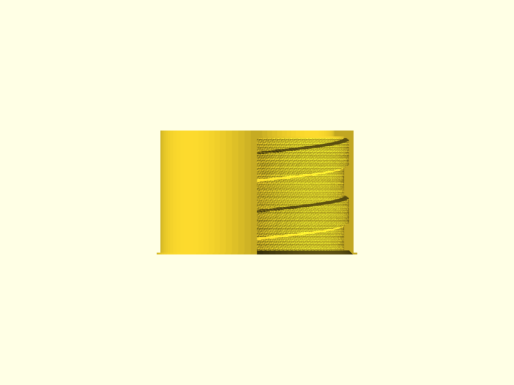
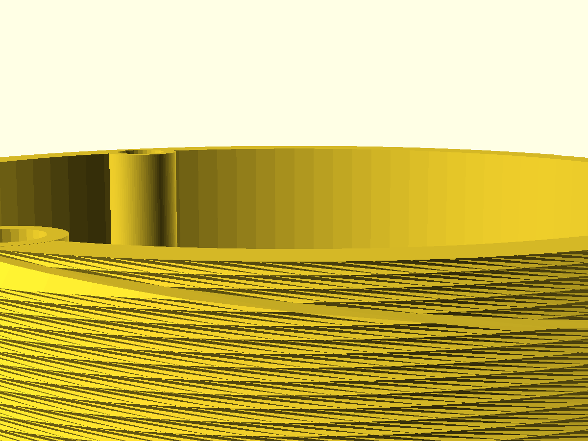
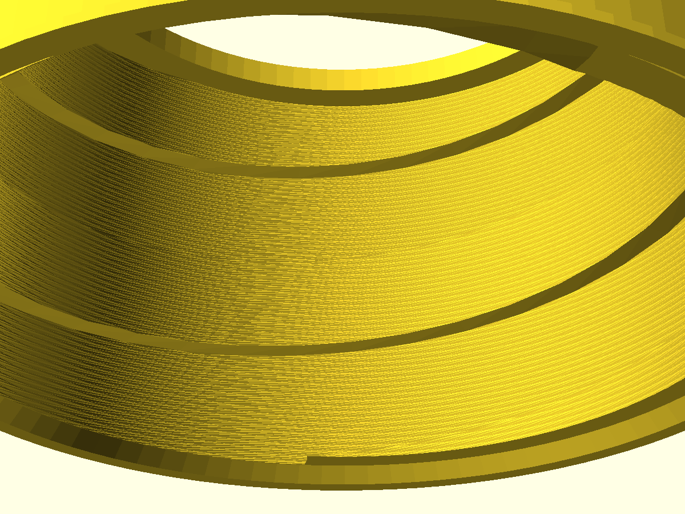
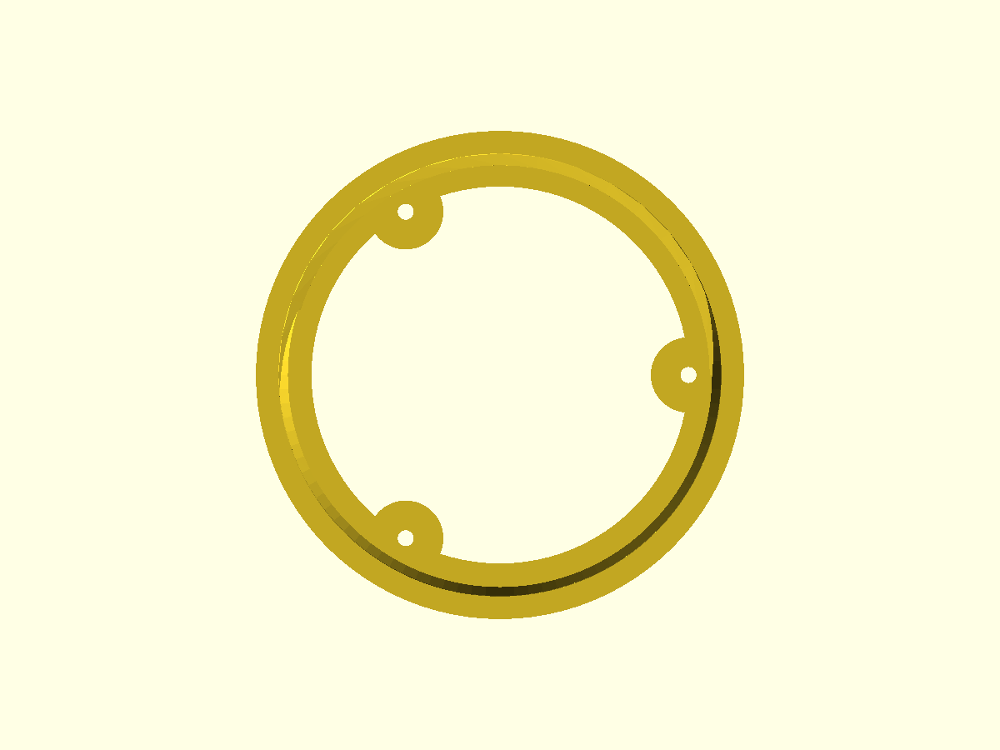
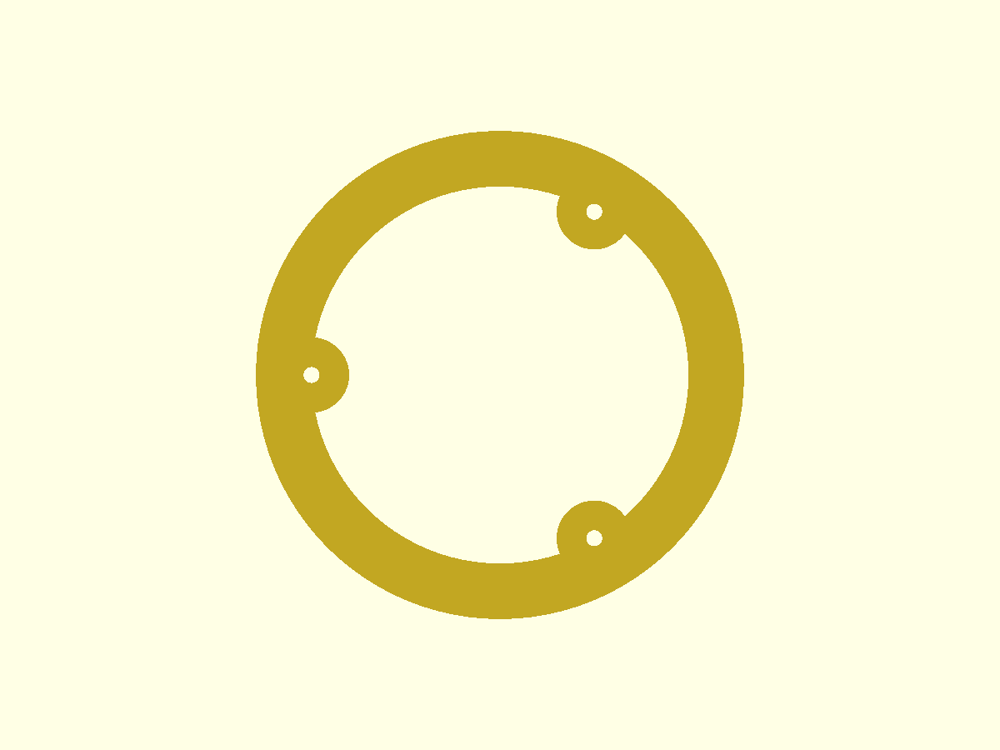

# Acoplador de módulos — estrutura genérica Serra Rocketry (v0.10)

Arquivo: `acoplador-modulos.scad` (OpenSCAD paramétrico)
Status: rascunho validado geometricamente (malha watertight + encaixe do par sem interferência), **medidas ainda chutadas** — ajustar com as medidas reais dos tubos antes de imprimir.

## O que é

Acoplador entre módulos do foguete (tubos de ~ID 100 mm). Duas peças:

- **Macho**: corpo de 60 mm que é colado DENTRO do tubo A + espiga rosqueada de 60 mm que fica para fora.
- **Fêmea**: anel de 64 mm colado dentro do tubo B, com recesso rosqueado de 60 mm que recebe a espiga do macho.

O encaixe é uma **rosca própria de perfil V 60°** (trapezoidal, não usa lib de threads): passo 30 mm, 2 voltas inteiras, ângulo de hélice ~5,8° (visual de "parafuso", escolha do Angelo), flanco inclinado 30° da radial (`rosca_ang_flank`) com profundidade de filete 2,5 mm.

Desde a v0.9 o par tem **encaixe validado por malha** (sem interferência, folgas medidas — ver seção "Perfil V 60° e encaixe do par" abaixo).

Desde a v0.7 as duas peças têm um **lábio de batente de colagem** na boca (ver seção abaixo).

## Perfil V 60° e encaixe do par (v0.9)

### Por que mudou da quadrada (v0.8)

Pedido do Angelo: o perfil quadrado (flancos a 90°) é difícil de imprimir — canto vivo de 90° que o FDM não reproduz bem (o bico não limpa o canto interno e a aresta externa arredonda/empasta). O flanco virou **V 60° total = 30° da radial** (`rosca_ang_flank = 30`; 0 volta à quadrada), que imprime limpo.

### A descoberta: o par nunca rosqueava

Revisando o perfil no v0.9, encontramos um bug que existia **desde o v0.3**: o dente ocupava 55% do passo (16,5 mm) e o vão 45% (13,5 mm). Para um par rosquear, o dente precisa ser **menor que o vão** — com dente 16,5 > vão 13,5 o encaixe é impossível em qualquer fase de rotação. Os renders "montado" das versões anteriores mostravam as duas peças **se intersectando** (a fêmea é o negativo do cutter e na mesma fase os dentes dela ocupam os vãos do macho — o render parecia montado justamente porque as malhas se atravessavam com transparência); nunca houve checagem de interferência entre as peças.

Correção: `larg_groove` (vão no raio médio) passou de 13,5 para **15,5 mm** → dente 14,5 mm no raio médio, com ~0,5 mm de folga axial por flanco (típico de rosca FDM). A 30° de flanco, o dente afina na crista (13,1 mm) e engrossa na raiz (15,9 mm).

### Outras correções do encaixe

- **Raiz da fêmea com sinal errado** (`raio_raiz_f` era `−tol`): o dente da fêmea alcançava DENTRO do raio do macho. Agora `+tol` nos dois raios — folga radial real, e com o flanco V a folga radial vira **folga axial de flanco ~0,5-0,6 mm** (V 60° converte deslocamento radial em folga no flanco; perfil quadrado não faz isso).
- **Piso plano no fundo do vão** (`rosca_fundo_flat = 0,3 mm`): o V inicial saiu com a malha fragmentada (slivers de volume zero na junção flanco→núcleo); o piso deixa a junção radial (como na v0.8), a malha fecha limpa, e evita a ponta V na raiz (imprime melhor e dá resistência).
- **Folga axial no fundo do recesso** (`fundo_extra = 1 mm`): prolongamento de furo liso Ø90 além da rosca — a fêmea assenta no ombro sem a ponta da espiga encostar no fundo (o recesso continua com 2 voltas inteiras, necessário pro twist fechar a malha).

### Validação do par (nova, nunca tinha sido feita)

Com o macho e a fêmea na posição montada (fêmea assentada no ombro; mesma fase = engrenamento correto, sem rotação), medindo a proximidade das malhas (trimesh + cKDTree):

- Macho e fêmea **watertight, 1 componente cada**, 0 warnings no CGAL.
- **Zero penetração**; distância mínima real = **0,206 mm** — exatamente a folga projetada entre a ponta do dente da fêmea (r = 45,0) e o início do flanco do macho (r = 44,8, piso do vão).
- Percentis da distância na zona rosqueada: p1 ≈ 0,9 mm, p5 ≈ 1,0 mm, mediana ≈ 2,2 mm (folgas de flanco e radial ~0,5 mm + vão livre).
- (Booleans CGAL entre as duas STLs derrubam o Nef por facetas degeneradas/contato coplanar — por isso a validação é por proximidade de vértices, não por interseção de sólidos.)

## Lábio de batente de colagem (v0.7)

Cada peça tem um anel fino na borda que fica na boca do tubo quando colada — serve de batente: na hora de colar, o tubo encosta no lábio e **não deixa a peça entrar demais** (a profundidade de colagem fica definida e igual nas duas pontas).

- **Macho**: anel na borda superior do corpo, no ombro onde a espiga nasce (os últimos `labio_esp` mm do corpo têm OD maior). O tubo A encosta aí quando o corpo está todo dentro.
- **Fêmea**: anel na boca do recesso (face z=0). O tubo B encosta aí com a boca alinhada à face que recebe o macho.
- **Geometria**: anel de espessura axial `labio_esp` = 1 mm (paramétrico; 0,4 mm é o mínimo de 1 parede FDM) e OD `labio_od` = 103,6 mm — OD do tubo (ID 100 + parede 2 mm, medida real) menos 0,4 de folga, para ficar **flush por fora** (nunca passar do OD do tubo).
- Parâmetros: `labio_on` (liga/desliga), `labio_esp`, `tubo_id`, `tubo_parede` (= 2, real), `labio_od`.
- Na montagem os dois lábios se encontram na junta (ombro z=60) e formam um colar contínuo de ~2 mm com o OD do tubo — a junta fica limpa por fora.

## Chanfro de guia na rosca (v0.8)

Para **facilitar o encontro e a inserção** na hora de encaixar (pedido do Angelo: "um filete no topo da rosca, parte externa, e na parte de baixo da fêmea, parte interna"):

- **Macho**: chanfro de 45° na aresta externa do **topo da rosca** (ponta da espiga, por onde ela entra) — a crista chega afunilada (Ø94 → Ø90 na face da ponta), então o começo da rosca não "pega" torto na entrada.
- **Fêmea**: chanfro de 45° na aresta interna da **boca do recesso** (z=0, a parte de baixo) — alarga a entrada (boca de sino, Ø94,8 → Ø98,8 na face) e guia a espiga pro centro.
- Parâmetros: `chanfro_on` (liga/desliga) e `chanfro_rosca` = 2 mm (45°).
- ⚠️ Na fêmea o chanfro não pode passar da parede da boca (2,4 mm sem lábio; com lábio o aro continua com ~2,4 mm).

## Imagens (v0.9: montado/explodido/cortes; detalhes e vistas v0.8 — geometria equivalente, geradas do STL real — CGAL)

Conjunto **montado** (macho laranja translúcido + fêmea azul rosqueada por cima, assentada no ombro) e **explodido** (fêmea separada acima) — dá pra ver a espiga do macho através da fêmea, a rosca em hélice real (perfil V 60°), os lábios de batente na junta e o chanfro na ponta do macho:

 

Cortes axiais CGAL (export da diferença, não preview) mostrando o perfil V 60° — macho (dentes externos, flancos inclinados 30° da radial, mais finos na crista) e fêmea (rosca interna, vãos escuros entre dentes):

 

Detalhes do chanfro de guia — ponta do macho (bisel 45° na aresta do topo) e boca da fêmea (boca de sino na entrada do recesso):

 

Vista de topo (espiga chanfrada) e vista de baixo (coroa inferior, com os bosses/furos dos tirantes a 120°) — renders ortográficos do STL real:

 

> Nota: preview rápido do OpenSCAD (~1 s) NÃO mostra a rosca direito (parece anéis); essas imagens foram geradas do STL exportado (CGAL). O olho humano decide o visual.

---

## POR QUE OS TIRANTES (parafusos longitudinais)

### O problema (contexto FDM)

Toda peça impressa em FDM é feita de **camadas empilhadas** (discos/círculos no plano XY). A adesão **entre** camadas é o elo fraco da peça — muito menor que a resistência dentro da própria camada.

No acoplador, a carga de uso (empuxo, recuperação, torque de rosquear a fêmea) tende a **separar as camadas umas das outras** na direção Z (axial). Ou seja: o modo de falha mais provável da peça é a **delaminação**, não a quebra do material.

### A solução

No macho (a peça que recebe a fêmea e o esforço de rosquear), 3 parafusos longitudinais atravessam a peça inteira — do corpo (dentro do tubo) até quase o topo da espiga rosqueada — e **costuram as camadas**: cada parafuso é um tirante que comprime os "círculos" empilhados uns contra os outros, exatamente como um tirante de concreto ou um parafuso passante num sanduíche de madeira.

Se uma camada tenta abrir/separar da vizinha, o parafuso impede o movimento.

### Por que só no macho?

- A **fêmea** fica inteira colada DENTRO de um tubo — a cola epóxi em volta do diâmetro externo já segura as camadas entre si. Não precisa de tirante.
- O **macho** também tem o corpo colado no tubo A, mas a **espiga rosqueada fica para fora, exposta** — nesse trecho a cola não alcança, e é exatamente ali que a fêmea rosqueia com torque. Os tirantes atravessam corpo + espiga porque a parte crítica é a espiga exposta, sem cola segurando as camadas.

### Como ficou (detalhes construtivos)

- **3 bosses (protuberâncias) na parede INTERNA**, a 120° entre si, do corpo até quase o topo da rosca. Engrossam a parede para dentro (não mudam o OD → não atrapalham a colagem no tubo) e dão material ao redor de cada parafuso.
- **Desde a v0.10 o boss é Ø16 UNIFORME no corpo e na espiga** (pedido do Angelo: "não tem lógica uma parte mais fina"). Antes a espiga era Ø9 porque um boss Ø16 centrado no tirante (r=40) invadiria a raiz da rosca (Ø89/2=44,5). Para engordar o boss sem furar a rosca, o tirante+boss foi **movido para dentro**: `boss_centro`/`tirante_r` são derivados da raiz (`boss_centro = rosca_id/2 − boss_d/2 − 0,5`), então o lado externo do boss fica 0,5 mm abaixo da raiz e a rosca fica intacta.
- **Parafuso atravessa corpo + espiga** (costura as camadas das duas regiões), parando ~2 mm antes do topo da rosca (`margem_topo`).
- **Cabeça allen embutida no topo da espiga**, afundada (acabamento: nada fica saliente). Aperto com chave allen com a fêmea desrosqueada.
- **Porca travada em bolsão hexagonal** na coroa inferior (embutida ~1 mm, `margem_fundo`). O bolsão hexagonal impede a porca de girar; o aperto é pela cabeça.
- **A fêmea rosqueia por fora e não toca em nada dos parafusos** (eles vivem no interior da parede do macho).
- Parafuso de rosca total longo: barra roscada M3/M4/M5 + porca, ou DIN912 rosca total no comprimento (~118 mm).

### Parâmetro de tamanho

`parafuso_m = 3` → troque para `4` (M4) ou `5` (M5) e o furo, cabeça, porca e boss se ajustam sozinhos (tabela no topo do arquivo).

Desde a v0.10 o boss é Ø16 uniforme e o `boss_centro`/`tirante_r` são **derivados** da raiz da rosca (`boss_centro = rosca_id/2 − boss_d/2 − 0,5`), então trocar de M3 para M4/M5 move o tirante+boss automaticamente para dentro e **não invade a raiz** (M3: r=36, M4: r=35, M5: r=34,25). O furo central na altura dos bosses cai junto: M3 Ø56, M4 Ø52, M5 Ø49.

### Trade-offs aceitos

| Item | Antes (v0.5) | Depois (v0.6) | Motivo |
|---|---|---|---|
| Furo interno | 84 mm | 80 mm | dar parede (9,8 mm) p/ os parafusos e reforçar a raiz da rosca |
| Furo central livre na altura dos bosses | — | ~64 mm (corpo) / ~71 mm (espiga) | os bosses protuberam p/ dentro; passagem continua folgada |

> **v0.10**: com o boss Ø16 uniforme + tirante movido p/ dentro (r=36, M3), o furo central livre na altura dos bosses cai p/ **Ø56**. Confirme que ainda passa o que for necessário (hoje é só a chave allen longa).

---

## Validação feita

- Malha: macho e fêmea **watertight**, 1 componente cada, sem warnings no CGAL (medido com trimesh no pipeline do Oráculo).
- Encaixe do par (v0.9): posição montada (fêmea no ombro) sem penetração; folga mínima medida 0,206 mm (ponta do dente da fêmea → início do flanco do macho); folgas de flanco ~0,5 mm (script `check_v09_pair.py` / `check_close.py`).
- Rosca confirmada como **hélice real** por medição de malha (fase gira −11,99°/mm = passo 30,01 mm), não "anéis" visuais.
- Renders: preview rápido (~1 s) NÃO mostra a rosca direito; o que vale é export STL (CGAL) + cena importando o STL. O olho humano decide o visual.

---

## Histórico das versões (resumo)

- **v0.1**: tentativa com `threads.scad` (lib do altimeter-egg). Com Ø94 o polyhedron helicoidal se fragmenta (filetes soltos, 23 volumes). Abandonado.
- **v0.3**: rosca quadrada própria (linear_extrude + twist). Na época: perfil quadrado é melhor p/ FDM (flanco 90° aguenta mais carga e delamina menos que V fino) — **revisado na v0.9** (canto 90° é difícil de imprimir → V 60°). Passo 8 mm, 7 voltas.
- **v0.4**: passo 16 mm (ângulo mais visível), 4 voltas.
- **v0.5**: passo 30 mm com 2 voltas (decisão do Angelo: ângulo maior, poucas voltas), filete 2,5 mm.
- **v0.6**: tirantes anti-delaminação (esta versão). Furo interno 84→80.
- **v0.7**: lábio de batente de colagem no macho (ombro) e na fêmea (boca do recesso); parede do tubo confirmada = 2 mm (ID 100 / OD 104).
- **v0.8**: chanfro de guia 45° (2 mm paramétrico) no topo da rosca do macho (ponta da espiga) e na boca do recesso da fêmea (boca de sino) — facilita encontro/inserção.
- **v0.9**: perfil **V 60°** (pedido do Angelo: quadrada com flanco 90° é difícil de imprimir) + **encaixe corrigido** — descoberto que desde o v0.3 o dente (55%) era maior que o vão (45%) e o par nunca rosquearia; rebalanceado p/ dente 14,5/vão 15,5; raiz da fêmea com sinal corrigido (+tol); piso plano no vão (malha fecha limpa); folga axial no fundo do recesso; validação de interferência do par criada (0,206 mm de folga mínima, zero penetração).
- **v0.10**: boss **Ø16 uniforme** no corpo e na espiga (pedido do Angelo: "não tem lógica uma parte mais fina"). A espiga era Ø9 p/ não invadir a raiz da rosca; para engordar sem furar a rosca, tirante+boss movidos p/ dentro (`boss_centro`/`tirante_r` derivados da raiz = `rosca_id/2 − boss_d/2 − 0,5`). M3: tirante r=36, boss outer 44 (0,5 mm abaixo da raiz), rosca intacta; furo central na altura dos bosses cai de ~Ø64/Ø71 p/ Ø56. Removido `boss_esp_d` (fim do Ø9).

## Pendências

- [ ] **Imprimir o par e testar o rosqueamento** — folga de flanco ~0,5 mm é o chute típico FDM; validar na prática e ajustar `rosca_tol`/`larg_groove` se preciso.
- [ ] Medir os tubos reais e ajustar: OD 99,6 (hoje hipótese p/ tubo ID 100 — folga de cola), comprimentos de colagem.
- [ ] Furos para inserts de latão (#10) — provavelmente na fêmea/flanges.
- [ ] Decidir M3 vs M4/M5 para o tirante (dependente da carga real estimada).

## Ferramentas / como validar

- Renders/STL pesados rodam no **Oráculo** (TrueNAS x86, 192.168.1.190), não no Pi local:
  `CAD_DOCKER="sudo -n docker" /mnt/Fortaleza/cad-toolchain/cad-run.sh render|stl|python <arquivo>`
- Validação de malha/rosca: `check_stl_pair.py` (watertight/extents/hélice) e `check_helice.py` (passo por rotação de fase).
- Preview PNG de ~1 s NÃO mostra a rosca corretamente — a verdade geométrica vem do STL (CGAL) + medição.
