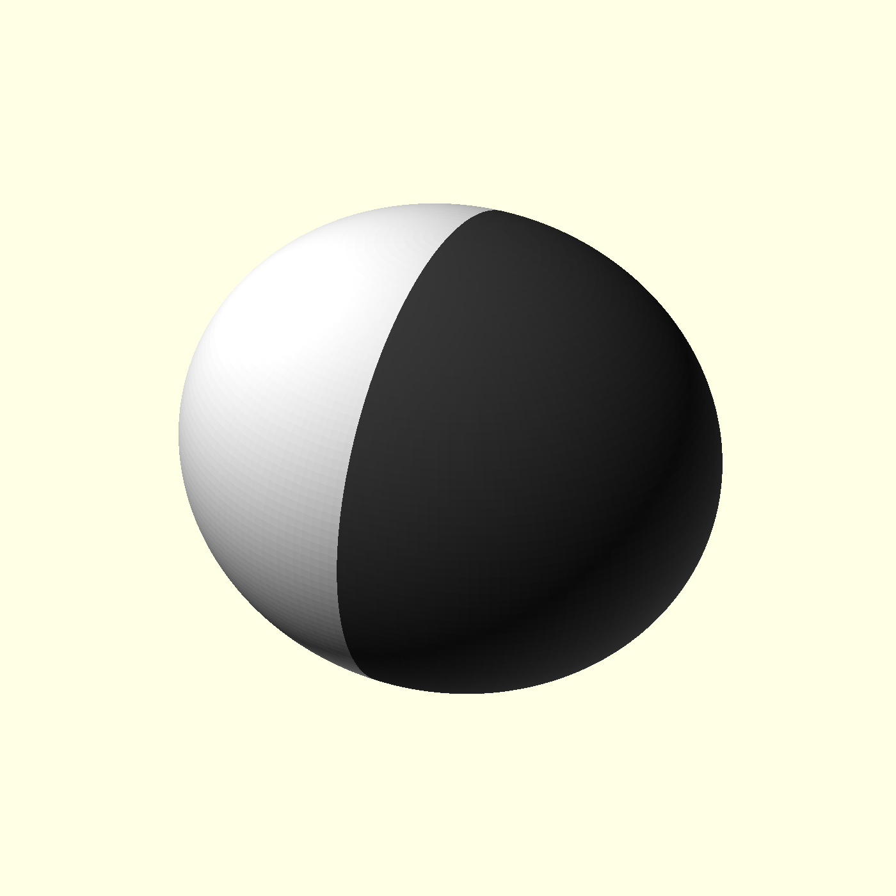
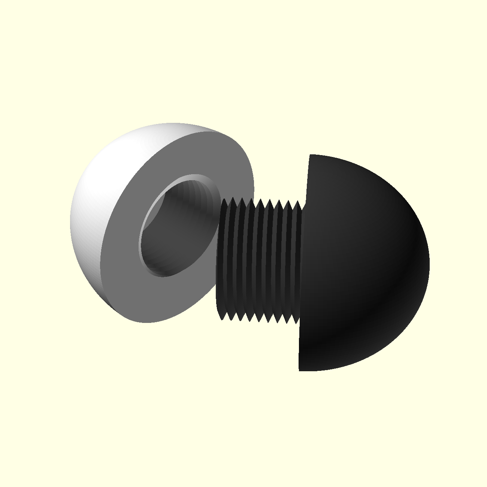
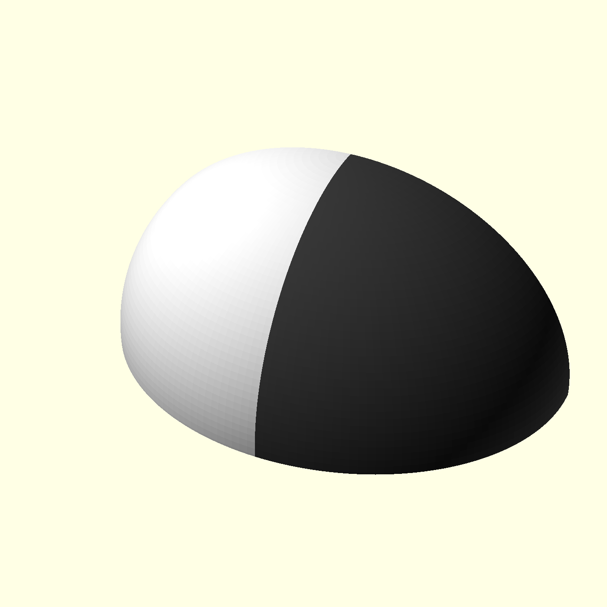
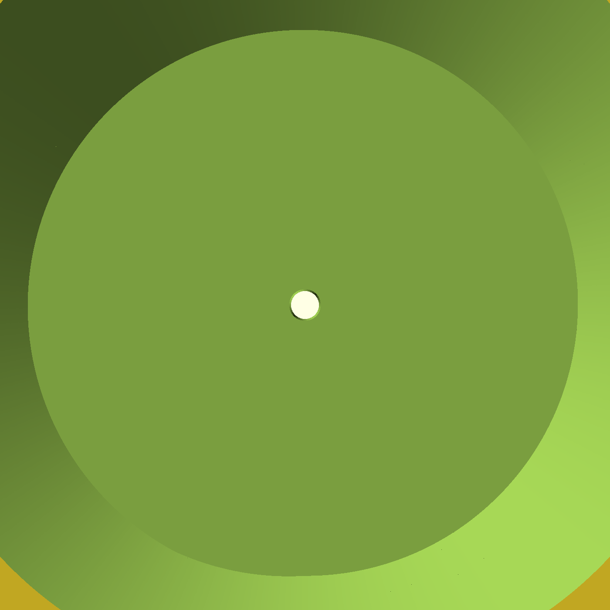
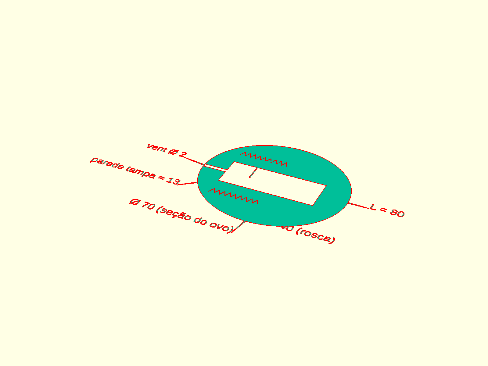
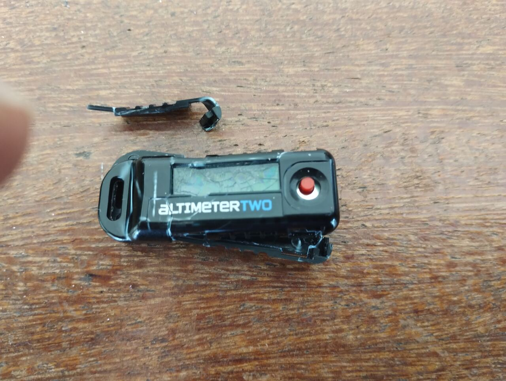
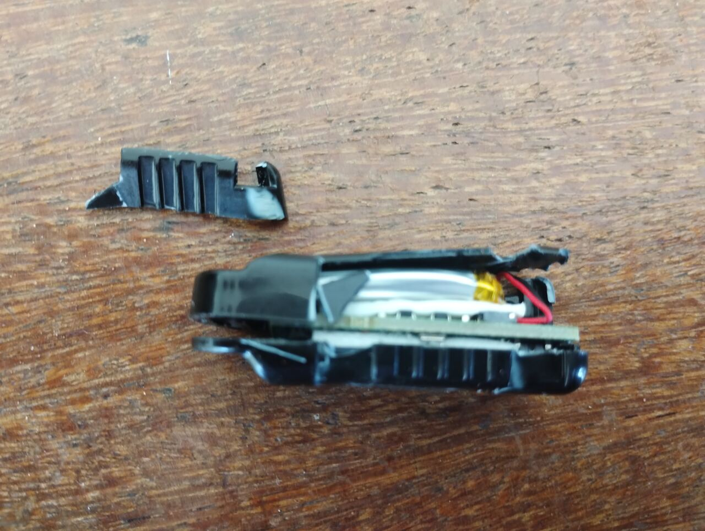
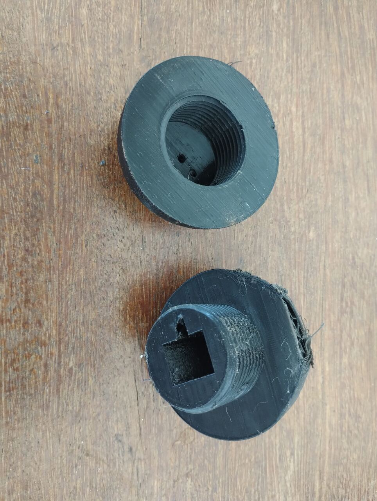
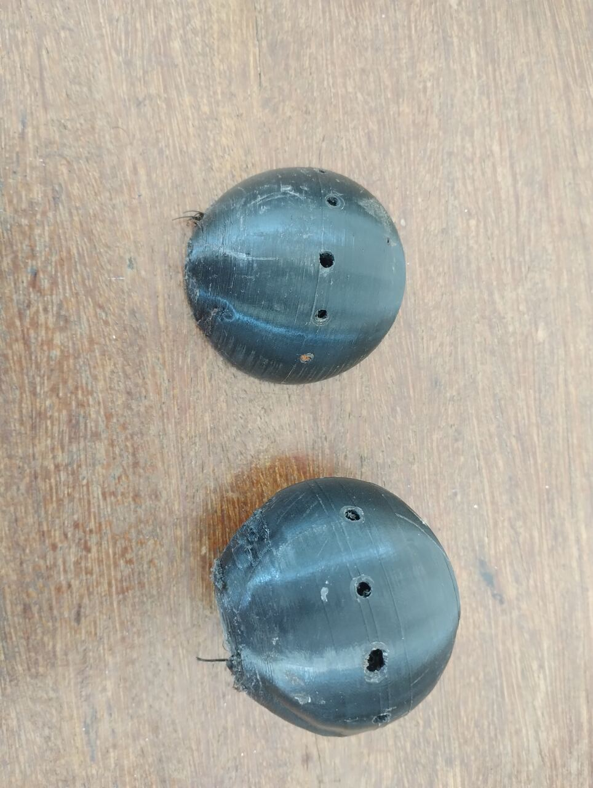

# Design — Cápsula do Altímetro (altimeter-egg)

[← Voltar ao índice](../README.md)

## Objetivo

Proteger o altímetro **Jolly Logic AltimeterTwo** (14.5 × 18 × 49 mm) contra impacto no pouso de foguetes de modelismo. A cápsula é **elipsoidal** (sem cantos vivos) para dissipar impacto; ela **não** pertence ao sistema de recuperação.

## Decisões de Design

### Forma: elipsoide (ovo)
- Ovo de **80 mm (eixo maior, X)** × **70 mm (seção, Y/Z)**, com o eixo maior alinhado ao comprimento do aparelho (49 mm).
- Forma arredondada (sem cantos vivos) → boa dissipação de energia no impacto.

### Duas peças com rosca métrica
| Peça | Função | Rosca |
|------|--------|-------|
| **Corpo** | metade do ovo + **colar** de rosca (macho) que, junto com a metade, envolve todo o altímetro | externa |
| **Tampa** | calota maciça que fecha enroscando | interna (fêmea) |

- O colar é um **tubo com o furo retangular do aparelho atravessando o centro** (o altímetro passa por dentro).
- A rosca é gerada pela biblioteca `threads.scad` (`ScrewThread`), **métrica, feita para impressão 3D** — filete largo (passo 3 mm) e grosso, fácil de imprimir.

### Encaixe e tolerâncias
- Folga do encaixe macho/fêmea: **0.35 mm**.
- A tampa é **maciça** (o aparelho fica todo no corpo + colar), apenas com a cavidade de rosca interna.

### Vent hole (entrada de ar / pressão)
- Furo de **Ø 2 mm** na ponta da **tampa** (eixo X, centro y=z=0) — o AltimeterTwo mede
  pressão e precisa do ar externo. Atravessa a parede da calota (x=-40 → -27) e abre na
  cavidade da rosca, comunicando com o interior da cápsula.
- Parâmetros: `vent_d`, `vent_h`, `vent_x` (para mover para a ponta do corpo, trocar o
  sinal de `vent_x`).

### Modelo paramétrico
- `hardware/cad/altimeter-egg.scad` (OpenSCAD), todos os parâmetros no topo do arquivo (`L`, `D`, `dev_*`, `thl_*`).
- Modos de visualização: `solid`, `filled`, `corpo`, `tampa`, `assembled`, `split`, `cutaway`, `xray` (transparência via F5).

## Renderização (imagens em `docs/images/`)

| Arquivo | Descrição |
|---------|-----------|
| `altimeter_egg_corpo_v1.png` | Corpo (metade + colar de rosca macho) |
| `altimeter_egg_tampa_v1.png` | Tampa (fêmea) |
| `altimeter_egg_explodida_v1.png` | Vista explodida (peças afastadas) |
| `altimeter_egg_montada_v1.png` | Montada (fechada) |
| `altimeter_egg_xray_v1.png` | Transparência (interior) |
| `altimeter_egg_tampa_v2.png` | Tampa com vent hole (ponta em vista frontal) |
| `altimeter_egg_ventcut_v2.png` | Corte no plano y=0 — túnel do vent hole |
| `altimeter_egg_techdraw_v1.png` | Desenho técnico (meia-seção + cotas) |

Desenho técnico **vetorial** (SVG): [`docs/drawings/altimeter_egg_techdraw.svg`](drawings/altimeter_egg_techdraw.svg) — gerado pelo próprio OpenSCAD (`mode="techdraw"`), seção longitudinal com cotas principais (L=80, Ø70, Ø40 da rosca, rosca=27, vent Ø2, parede ≈13).

## Voo de validação (Thonyan, 500 m)

> Contexto: a cápsula voou no foguete **Thonyan** (LASC 2026, 0.5 km SRM). Registro feito após o lançamento.

### Ocorrência

- Voo **balístico**: o paraquedas não abriu e o foguete caiu livremente.
- **Thonyan sofreu major damage.**
- A cápsula TPU **protegeu o altímetro** — apesar da queda, o AltimeterTwo sobreviveu.

### Danos observados no altímetro

| Componente | Estado |
|------------|--------|
| Tela | Quebrada |
| Conector USB da placa | Solto (sem cabo/tração; não estava conectado) |
| PCB | Aparentemente OK |

- A borda da cápsula apresenta marcas de impacto (as cascas com vent hole resistiram à deformação do choque).

### Fotos

| Arquivo | Descrição |
|---------|-----------|
| `images/altimeter_egg_posvoo_altimetro_frente.jpg` | Altímetro danificado (frente do case) |
| `images/altimeter_egg_posvoo_altimetro_lateral.jpg` | Altímetro aberto (lado) |
| `images/altimeter_egg_posvoo_rosca_corpo_tampa.jpg` | Peças TPU com rosca (corpo/tampa) |
| `images/altimeter_egg_posvoo_cascas_topo.jpg` | Cascas do ovo (topo, com furos) |

### Lições aprendidas e melhorias

A queda foi um teste de impacto real e mostrou o que precisa evoluir. A direção proposta é a consolidação de **três camadas** (macio → rígido → macio):

1. **TPU egg (externa)** — boa em absorver energia via deformação, mas pouco eficaz em desacoplar o **choque de alta frequência**: deixa o pico de aceleração chegar ao PCB.
2. **Tubo de metal (intermediário)** — distribui carga pontual, resiste à **onda de choque** e dá uma distância de esmagamento definida (é o que faz o motor sempre sobreviver).
3. **Espuma macia (interna)** — a camada que realmente protege a eletrônica: transforma o spike de alta frequência em deformação lenta. Sugerida em **meia-casca** (ex.: polietileno reticulado / Plastazote, EPDM/neoprene, célula fechada).

**Atenção (crítico):** o **vent hole deve atravessar todas as camadas** (TPU → furo no tubo de metal → furo na espuma → sensor de pressão). Se a espuma for uma luva fechada, ela bloqueia a equalização de pressão. Por isso a espuma em **meia-casca**, mantendo o canal de ar livre.

> Detalhes adicionais de projeto e iteração serão adicionados depois.

## Próximos passos (sugestões)
- Validar com o **STL real** do altímetro (substituir a caixa paramétrica por `import("altimeter.stl")` — ativar `show_stl`).
- Ajustar a folga da rosca a partir do primeiro teste de impressão (TPU, Ender 3).
- Definir acomodação de cabos/passagem de pressão, se necessário.
