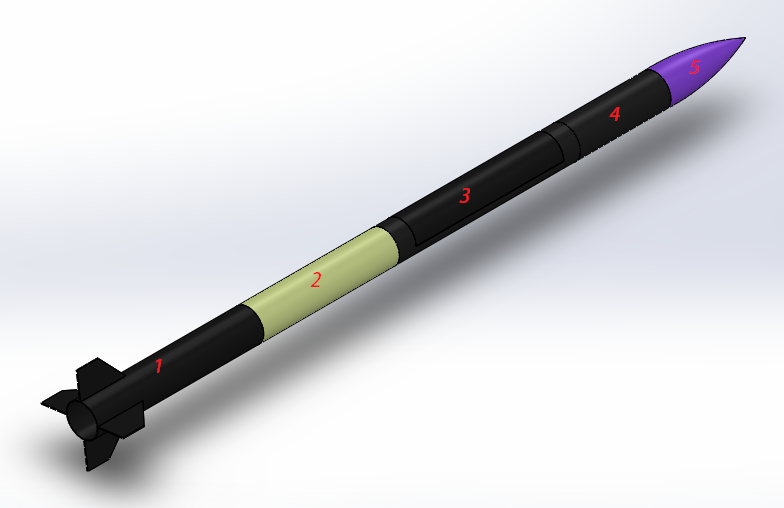
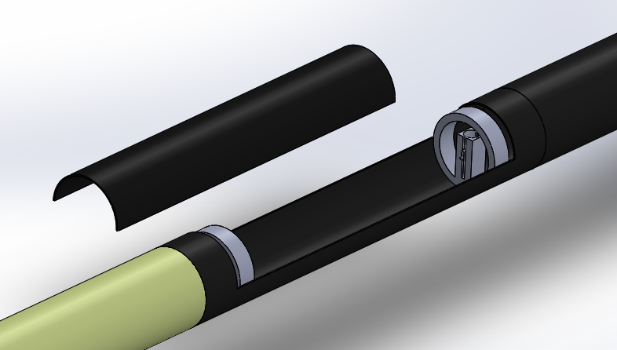

# Decisões de Design — Dédalo SR4-1000

[← Voltar ao índice](../README.md)

## Nomenclatura

O projeto segue o padrão `SR<foguete>-<apogeu>`:

- **SR4-1000** → Serra Rocketry, 4º foguete, apogeu de 1000 m

## Geometria

### Formato Geral

- **Tipo**: Foguete de corpo cilíndrico com cone de nariz ogival
- **Diâmetro interno**: 100 mm
- **Diâmetro externo**: 104 mm (espessura de parede: 2 mm)
- **Comprimento total**: ~2400 mm

### Design Modular

A adoção de um design modular foi uma escolha estratégica do projeto, visando:

- Agilizar a integração na área de lançamento
- Simplificar manutenções futuras
- Permitir transporte e armazenamento facilitados

O foguete é composto por **5 módulos** interconectados:

| Módulo | Função | Comprimento |
|--------|--------|-------------|
| 1 | Acomodar o propulsor | 550 mm |
| 2 | Eletrônica embarcada | 450 mm |
| 3 | Sistema de recuperação | 600 mm |
| 4 | Estabilidade durante voo | 300 mm |
| 5 | Cone de nariz (redução de arrasto) | — |

Uma **tampa** de 500 mm complementa o módulo de recuperação.

## Materiais

| Componente | Material | Justificativa |
|------------|----------|---------------|
| Módulo 1 (propulsor) | Fibra de carbono | Alta resistência mecânica e térmica próxima ao motor |
| Módulo 2 (eletrônica) | Fibra de vidro | Permite propagação de ondas de rádio (telemetria, GPS) |
| Módulo 3 (recuperação) | Fibra de carbono | Resistência estrutural para carga de ejeção |
| Módulo 4 (estabilidade) | Fibra de carbono | Rigidez para aletas e estabilização |
| Cone de nariz | PETG | Impressão 3D, leveza, resistência a impacto |
| Tampa | Fibra de carbono | Compatibilidade com módulo de recuperação |

## Estrutura Interna

### Módulo 1 — Propulsor

- Acomoda o motor SRM (Solid Rocket Motor)
- Tubo em fibra de carbono de alta resistência térmica

### Módulo 2 — Eletrônica Embarcada

- Tubo em fibra de vidro para permitir comunicação por rádio
- Acomodação para placa de telemetria, altímetro, GPS

### Módulo 3 — Sistema de Recuperação

- Tubo em fibra de carbono com porta lateral de acesso
- A porta é fabricada a partir de um tubo adicional para manter o raio de curvatura da fuselagem
- Tampa em fibra de carbono para fechamento

> Os detalhes do mecanismo de ejeção (mola, trava, servo) estão documentados no repositório [recovery](https://github.com/Serra-Rocketry/recovery).

### Módulo 4 — Estabilidade

- Seção de 300 mm para montagem de aletas
- Contribui para a estabilidade aerodinâmica durante o voo

### Cone de Nariz — Módulo 5

- Impresso em PETG
- Formato ogival para redução de arrasto

## Pontos de Fixação

- Os módulos são conectados por **encaixe** entre tubos
- A tampa do sistema de recuperação utiliza fechamento lateral com trava mecânica
- O design permite montagem e desmontagem rápida em campo

## Referências

- Especificações extraídas do documento SR4-1000 (Pedro — Serra Rocketry)
- Latin American Space Challenge (LASC) 2026
