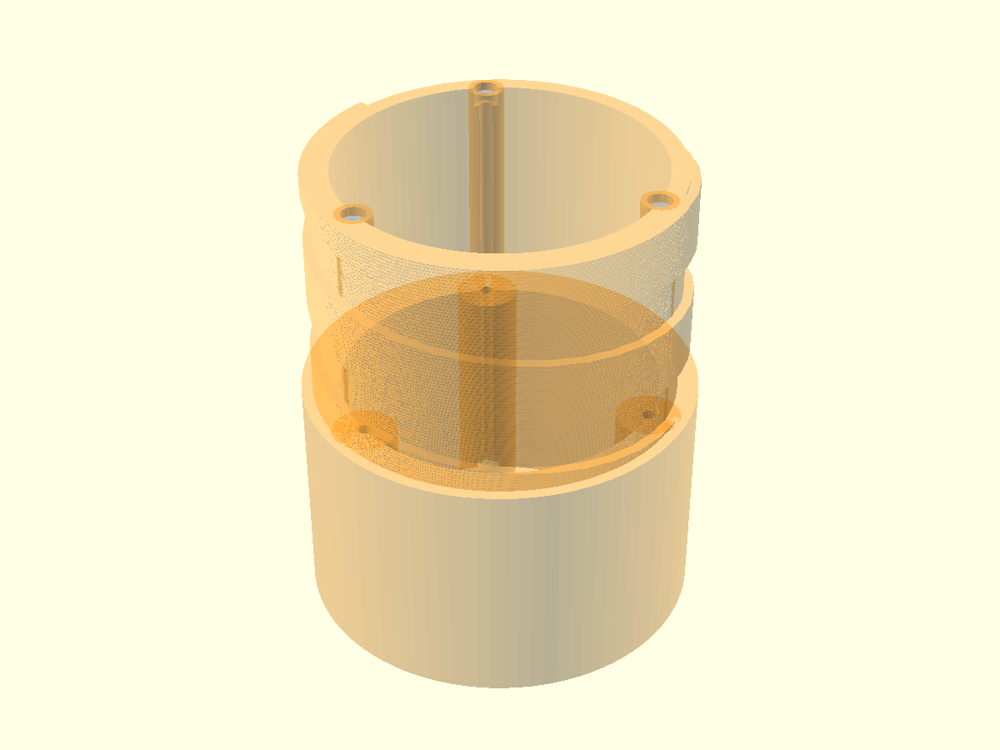
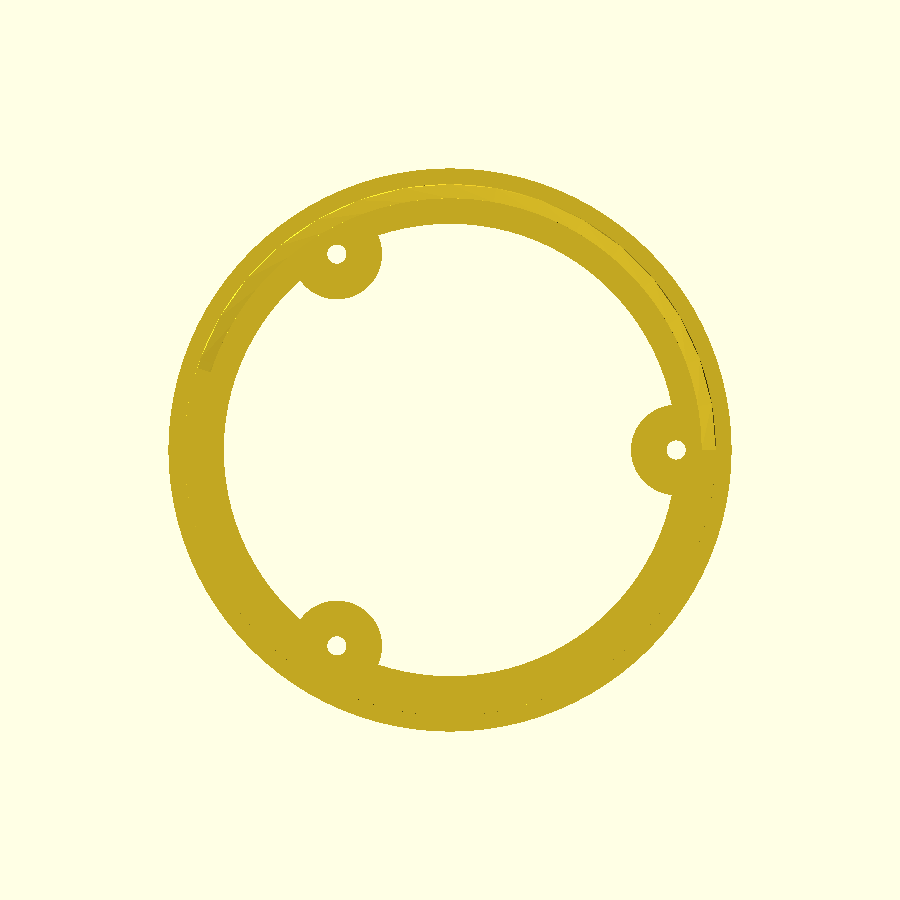
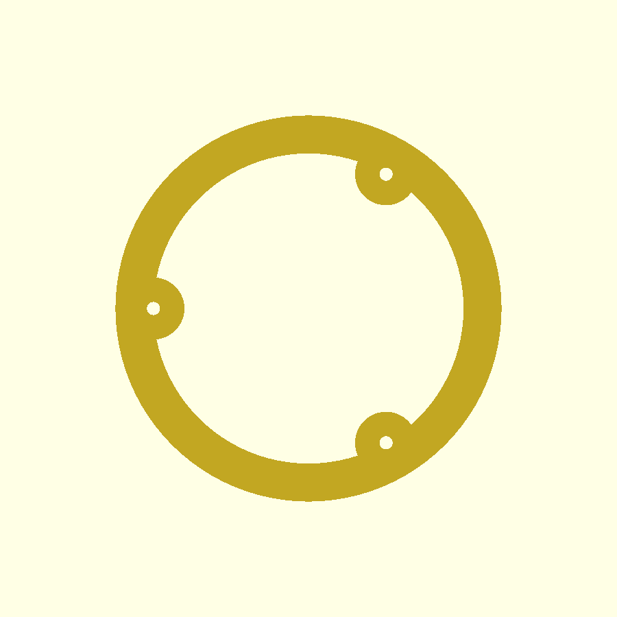

# Acoplador de módulos — Dédalo SR4-1000 (v0.6)

Arquivo: `acoplador-modulos.scad` (OpenSCAD paramétrico)
Status: rascunho validado geometricamente (malha watertight), **medidas ainda chutadas** — ajustar com as medidas reais dos tubos antes de imprimir.

## O que é

Acoplador entre módulos do foguete (tubos de ~ID 100 mm). Duas peças:

- **Macho**: corpo de 60 mm que é colado DENTRO do tubo A + espiga rosqueada de 60 mm que fica para fora.
- **Fêmea**: anel de 64 mm colado dentro do tubo B, com recesso rosqueado de 60 mm que recebe a espiga do macho.

O encaixe é uma **rosca quadrada própria** (não usa lib de threads): passo 30 mm, 2 voltas inteiras, ângulo de hélice ~5,8° (visual de "parafuso", escolha do Angelo), filete com 2,5 mm de profundidade.

## Imagens (v0.6 final, geradas do STL real — geometria CGAL)

Vista explodida do conjunto com o macho translúcido (laranja) e os 3 tirantes (cinza), mostrando a haste atravessando corpo + espiga até quase o topo da rosca:

Vista de topo (espiga) e vista de baixo (coroa inferior) — projeções ortográficas reais do STL:

 

> Nota: preview rápido do OpenSCAD (~1 s) NÃO mostra a rosca direito (parece anéis); essas imagens foram geradas do STL exportado (CGAL). O olho humano decide o visual.

---

## POR QUE OS TIRANTES (parafusos longitudinais)

### O problema (contexto FDM)

Toda peça impressa em FDM é feita de **camadas empilhadas** (discos/círculos no plano XY). A adesão **entre** camadas é o elo fraco da peça — muito menor que a resistência dentro da própria camada.

No acoplador, a carga de uso (empuxo, recuperação, torque de rosquear a fêmea) tende a **separar as camadas umas das outras** na direção Z (axial). Ou seja: o modo de falha mais provável da peça é a **delaminação**, não a quebra do material.

### A solução

No macho (a peça que recebe a fêmea e o esforço de rosquear), 3 parafusos longitudinais atravessam a peça inteira — do corpo (dentro do tubo) até quase o topo da espiga rosqueada — e **costuram as camadas**: cada parafuso é um tirante que comprime os "círculos" empilhados uns contra os outros, exatamente como um tirante de concreto ou um parafuso passante num sanduíche de madeira.

Se uma camada tenta abrir/separar da vizinha, o parafuso impede o movimento.

### Por que só no macho?

- O macho é onde a fêmea rosqueia com torque (e onde o tubo A transmite carga axial).
- A fêmea não recebe o mesmo tipo de esforço de rosqueamento direto na parede.
- Decisão do Angelo: reforço só no macho, para não complicar a fêmea.

### Como ficou (detalhes construtivos)

- **3 bosses (protuberâncias) na parede INTERNA**, a 120° entre si, do corpo até quase o topo da rosca. Engrossam a parede para dentro (não mudam o OD → não atrapalham a colagem no tubo) e dão material ao redor de cada parafuso.
- **Parafuso atravessa corpo + espiga** (costura as camadas das duas regiões), parando ~2 mm antes do topo da rosca (`margem_topo`).
- **Cabeça allen embutida no topo da espiga**, afundada (acabamento: nada fica saliente). Aperto com chave allen com a fêmea desrosqueada.
- **Porca travada em bolsão hexagonal** na coroa inferior (embutida ~1 mm, `margem_fundo`). O bolsão hexagonal impede a porca de girar; o aperto é pela cabeça.
- **A fêmea rosqueia por fora e não toca em nada dos parafusos** (eles vivem no interior da parede do macho).
- Parafuso de rosca total longo: barra roscada M3/M4/M5 + porca, ou DIN912 rosca total no comprimento (~118 mm).

### Parâmetro de tamanho

`parafuso_m = 3` → troque para `4` (M4) ou `5` (M5) e o furo, cabeça, porca e boss se ajustam sozinhos (tabela no topo do arquivo).

Nota M5: o rebaixo da cabeça (Ø 8,5 + folga) fica no limite do boss da espiga (que não pode invadir a raiz da rosca). Se for usar M5, aumentar `boss_esp_d` para ~10,2 (invade 0,2 mm da raiz localmente) ou aceitar rebaixo raso. M3/M4 ok.

### Trade-offs aceitos

| Item | Antes (v0.5) | Depois (v0.6) | Motivo |
|---|---|---|---|
| Furo interno | 84 mm | 80 mm | dar parede (9,8 mm) p/ os parafusos e reforçar a raiz da rosca |
| Furo central livre na altura dos bosses | — | ~64 mm (corpo) / ~71 mm (espiga) | os bosses protuberam p/ dentro; passagem continua folgada |

---

## Validação feita

- Malha: macho e fêmea **watertight**, 1 componente cada, sem warnings no CGAL (medido com trimesh no pipeline do Oráculo).
- Rosca confirmada como **hélice real** por medição de malha (fase gira −11,99°/mm = passo 30,01 mm), não "anéis" visuais.
- Renders: preview rápido (~1 s) NÃO mostra a rosca direito; o que vale é export STL (CGAL) + cena importando o STL. O olho humano decide o visual.

---

## Histórico das versões (resumo)

- **v0.1**: tentativa com `threads.scad` (lib do altimeter-egg). Com Ø94 o polyhedron helicoidal se fragmenta (filetes soltos, 23 volumes). Abandonado.
- **v0.3**: rosca quadrada própria (linear_extrude + twist). Perfil quadrado é melhor p/ FDM (flanco 90° aguenta mais carga e delamina menos que V fino). Passo 8 mm, 7 voltas.
- **v0.4**: passo 16 mm (ângulo mais visível), 4 voltas.
- **v0.5**: passo 30 mm com 2 voltas (decisão do Angelo: ângulo maior, poucas voltas), filete 2,5 mm.
- **v0.6**: tirantes anti-delaminação (esta versão).

## Pendências

- [ ] Medir os tubos reais e ajustar: OD 99,6 (hoje hipótese p/ tubo ID 100), comprimentos de colagem.
- [ ] Furos para inserts de latão (#10) — provavelmente na fêmea/flanges.
- [ ] Decidir M3 vs M4/M5 para o tirante (dependente da carga real estimada).
- [ ] Push do commit local (aguardando OK do Angelo — repo público da org).

## Ferramentas / como validar

- Renders/STL pesados rodam no **Oráculo** (TrueNAS x86, 192.168.1.190), não no Pi local:
  `CAD_DOCKER="sudo -n docker" /mnt/Fortaleza/cad-toolchain/cad-run.sh render|stl|python <arquivo>`
- Validação de malha/rosca: `check_stl_pair.py` (watertight/extents/hélice) e `check_helice.py` (passo por rotação de fase).
- Preview PNG de ~1 s NÃO mostra a rosca corretamente — a verdade geométrica vem do STL (CGAL) + medição.
